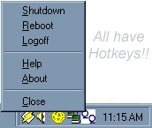



## Quick Quit v1\.0 \(A must see\!  Please vote, and leave comments\!\)

### Description

This TINY little app, shuts down your computer at the press of a combinations of keys, or by clicking (see picture!) I love it! Just hit Ctrl+Alt+S, and your computer shuts down! Great if you put it into your startup folder!
 
### More Info
 
Ctrl+Alt+R

Ctrl+Alt+S

Ctrl+Alt+L

Reboot

Shutdown

Logoff

None that I know of (Might not work on NT, or XP; but I am not sure!)

             |
---                |---
**Submitted On**   |2002-05-18 14:36:52
**By**             |[Paul Zaczkowski](https://github.com/Planet-Source-Code/PSCIndex/blob/master/ByAuthor/paul-zaczkowski.md)
**Level**          |Intermediate
**User Rating**    |4.0 (12 globes from 3 users)
**Compatibility**  |VB 5\.0, VB 6\.0
**Category**       |[Windows System Services](https://github.com/Planet-Source-Code/PSCIndex/blob/master/ByCategory/windows-system-services__1-35.md)
**World**          |[Visual Basic](https://github.com/Planet-Source-Code/PSCIndex/blob/master/ByWorld/visual-basic.md)
**Archive File**   |[Quick\_Quit846235182002\.zip](https://github.com/Planet-Source-Code/paul-zaczkowski-quick-quit-v1-0-a-must-see-please-vote-and-leave-comments__1-34913/archive/master.zip)

